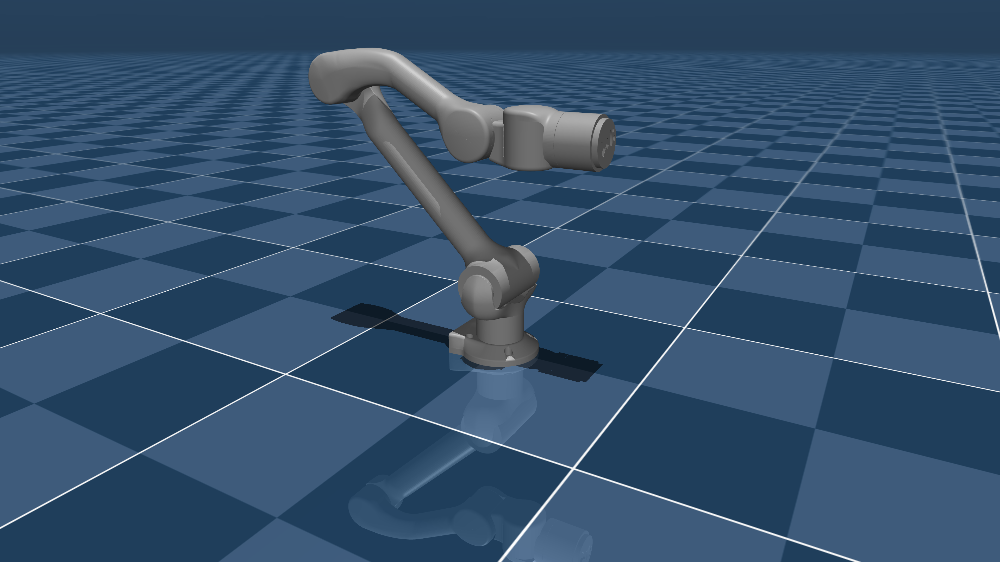

# Unitree Z1 MuJoCo Simulation

<p align="center">
  
</p>

<p align="center">
  <strong>MuJoCo simulation, control, inverse kinematics, and manipulation demos for the Unitree Z1 robotic arm.</strong>
</p>

<p align="center">
  <a href="LICENSE">
    
  </a>
  
  
  
</p>

---

## Overview

This repository provides a MuJoCo-based simulation environment for the **Unitree Z1 robotic arm**.

It includes robot and scene models, Python simulation utilities, inverse-kinematics experiments, force and torque control examples, trajectory interpolation, visualization tools, and pick-and-place demonstrations.

The repository can be used to:

* Inspect and simulate the Unitree Z1 model
* Test joint-position and torque-control strategies
* Experiment with forward and inverse kinematics
* Generate interpolated robot trajectories
* Prototype pick-and-place workflows
* Integrate MuJoCo simulation with Pinocchio
* Visualize robot motion and manipulation scenes

---

## Features

* Unitree Z1 MuJoCo model
* URDF and mesh assets
* Passive MuJoCo viewer examples
* Joint-position control
* Torque and force-control experiments
* Pinocchio-based kinematics and dynamics
* Inverse-kinematics demonstrations
* Cartesian trajectory interpolation
* Pick-and-place examples
* URDF path-repair utility

---

## Repository Structure

```text
.
├── assets/                           # Objects and manipulation-scene assets
├── examples_py/                      # Additional Python examples and interfaces
├── z1_description/                   # Meshes, xacro files, and robot descriptions
├── scene.xml                         # Main MuJoCo simulation scene
├── z1.xml                            # Unitree Z1 MuJoCo model
├── z1.urdf                           # Unitree Z1 URDF model
├── simple.py                         # Basic MuJoCo simulation and control tests
├── simple_working.py                 # Minimal working MuJoCo example
├── Z1Sim.py                          # MuJoCo and Pinocchio simulation wrapper
├── Force_control.py                  # Force and torque-control experiments
├── visualization.py                  # Lightweight visualization example
├── pick_and_place_initial.py         # Initial pick-and-place implementation
├── pick_and_place_final2.py          # Updated pick-and-place implementation
├── pick_place_interpolated.py        # Interpolated pick-and-place trajectories
├── moving_forward_inverse_kinematics.py
│                                      # Forward-motion and IK experiments
├── fix_urdf_local_paths.py           # Utility for repairing local URDF paths
├── install_dependencies.sh           # Dependency installation script
├── requirements.txt                  # Python dependencies
├── LICENSE                           # BSD 3-Clause License
└── README.md
```

---

## Requirements

* Python 3.9 or newer
* MuJoCo 3.x
* NumPy
* Pinocchio
* A working OpenGL display environment for visualization

The required Python packages are listed in [`requirements.txt`](requirements.txt).

---

## Installation

### 1. Clone the repository

```bash
git clone <REPOSITORY_URL>
cd <REPOSITORY_NAME>
```

Replace `<REPOSITORY_URL>` and `<REPOSITORY_NAME>` with the URL and directory name of your repository.

### 2. Create a virtual environment

```bash
python3 -m venv .venv
source .venv/bin/activate
```

On Windows:

```powershell
python -m venv .venv
.venv\Scripts\activate
```

### 3. Install the dependencies

Using `requirements.txt`:

```bash
pip install --upgrade pip
pip install -r requirements.txt
```

Alternatively, use the provided installation script:

```bash
bash install_dependencies.sh
```

### Pinocchio installation

Depending on the operating system and Python environment, Pinocchio may be available under either the `pin` or `pinocchio` package name.

Using conda-forge is recommended when installation through `pip` fails:

```bash
conda install -c conda-forge pinocchio
```

---

## Quick Start

Run commands from the repository root so that MuJoCo can resolve the XML, mesh, and URDF paths correctly.

Start with the basic simulation:

```bash
python simple.py
```

Run the minimal working example:

```bash
python simple_working.py
```

Run the MuJoCo and Pinocchio simulation wrapper:

```bash
python Z1Sim.py
```

Open the visualization example:

```bash
python visualization.py
```

---

## Examples

### Force and Torque Control

```bash
python Force_control.py
```

This script contains experiments related to robot-joint forces, torques, and low-level control.

### Inverse Kinematics

```bash
python moving_forward_inverse_kinematics.py
```

This example demonstrates robot motion using inverse-kinematics calculations.

### Interpolated Pick and Place

```bash
python pick_place_interpolated.py
```

This script generates interpolated motion between target poses for smoother manipulation trajectories.

### Pick-and-Place Experiments

```bash
python pick_and_place_initial.py
```

```bash
python pick_and_place_final2.py
```

These scripts contain different stages of the pick-and-place implementation.

---

## Script Guide

| Script                                 | Description                                                                            |
| -------------------------------------- | -------------------------------------------------------------------------------------- |
| `simple.py`                            | Loads `scene.xml`, prints model information, and performs basic joint and torque tests |
| `simple_working.py`                    | Provides a minimal working MuJoCo scene example                                        |
| `Z1Sim.py`                             | Combines MuJoCo simulation with Pinocchio-based kinematics and dynamics utilities      |
| `Force_control.py`                     | Contains force-control and torque-control experiments                                  |
| `visualization.py`                     | Loads and displays the robot scene using the MuJoCo viewer                             |
| `moving_forward_inverse_kinematics.py` | Tests forward movement and inverse-kinematics-based control                            |
| `pick_and_place_initial.py`            | Contains an early pick-and-place implementation                                        |
| `pick_and_place_final2.py`             | Contains a revised pick-and-place implementation                                       |
| `pick_place_interpolated.py`           | Uses trajectory interpolation for pick-and-place motion                                |
| `fix_urdf_local_paths.py`              | Repairs mesh and asset paths inside the URDF for a local checkout                      |

---

## Model Files

### `scene.xml`

The main MuJoCo scene file. It defines the simulation world and references the Unitree Z1 model and any additional objects.

### `z1.xml`

The MuJoCo model definition for the Unitree Z1 robotic arm.

### `z1.urdf`

The URDF representation of the Unitree Z1. It is primarily used by Pinocchio and other robotics tools that operate on URDF models.

### `z1_description/`

Contains the robot-description files, meshes, and ROS-style assets associated with the Unitree Z1.

---

## Asset Path Configuration

Some scripts may contain hardcoded URDF or mesh paths from the original development environment.

If a script cannot locate a mesh or URDF asset, run:

```bash
python fix_urdf_local_paths.py
```

You can also manually update the affected paths to point to the current repository directory.

For better portability, prefer paths relative to the repository root instead of absolute paths such as:

```python
"/home/user/project/z1_description/meshes/link01.STL"
```

A relative path is preferable:

```python
"z1_description/meshes/link01.STL"
```

---

## Troubleshooting

### MuJoCo cannot load the XML model

Confirm that the command is being run from the repository root:

```bash
pwd
ls
```

The output should include files such as:

```text
scene.xml
z1.xml
z1.urdf
```

### Mesh or URDF files cannot be found

Run:

```bash
python fix_urdf_local_paths.py
```

Then verify that the mesh paths inside the URDF point to valid files.

### The MuJoCo viewer does not open

Check that:

* A graphical display is available
* OpenGL is configured correctly
* You are not running in a headless terminal without display forwarding
* The required MuJoCo Python package is installed

For SSH environments, X11 forwarding or another remote-display solution may be required.

### Pinocchio cannot be imported

Try installing it through conda-forge:

```bash
conda install -c conda-forge pinocchio
```

Then verify the installation:

```bash
python -c "import pinocchio; print(pinocchio.__version__)"
```

### Dependencies are missing

Activate the intended virtual environment and reinstall the dependencies:

```bash
source .venv/bin/activate
pip install -r requirements.txt
```

---

## Future Improvements

Potential extensions include:

* ROS 2 integration
* MoveIt 2 motion planning
* Cartesian impedance control
* Collision-aware trajectory planning
* Grasp-pose generation
* Camera and depth-sensor simulation
* Reinforcement-learning control policies
* Sim-to-real transfer to the physical Unitree Z1
* Improved modularity for controllers and tasks

---

## Maintainer

**Bibek Poudel**
Computer Engineering and Robotics
New York University Abu Dhabi

Email: [bp2376@nyu.edu](mailto:bp2376@nyu.edu)

---

## License

This project is licensed under the [BSD 3-Clause License](LICENSE).
